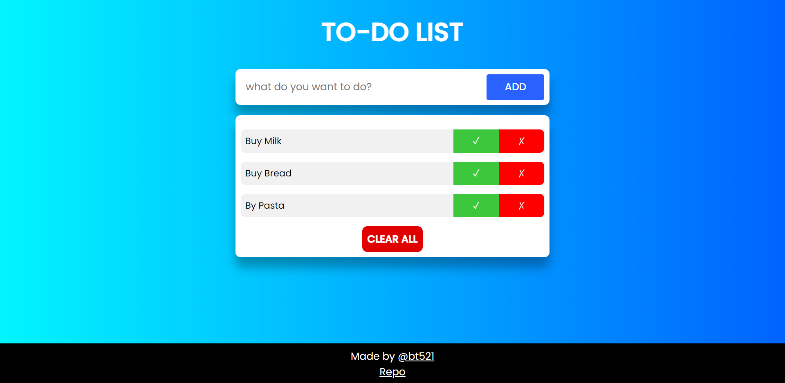

#JS_Todo_app

A To-Do application in created using JavaScript. **[link](https://briantwene.github.io/js_todo_app/)**

## Features

- Add/delete tasks
- Mark some tasks as complete
- Clear All button if you want to get rid of all tasks
- your list is stored locally, can come back to it even if you turn off your device
- Responsive can be used on a range of screen sizes from small phones to big screens

## Languages

Made with:

- HTML
- CSS
- JavaScript
